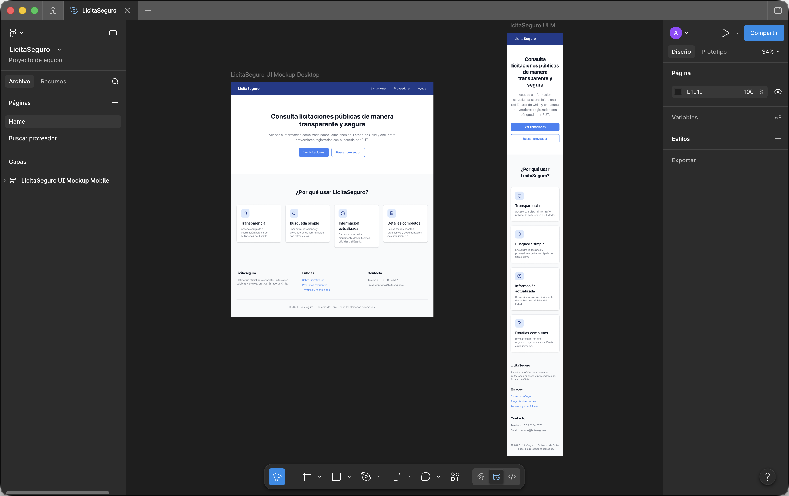
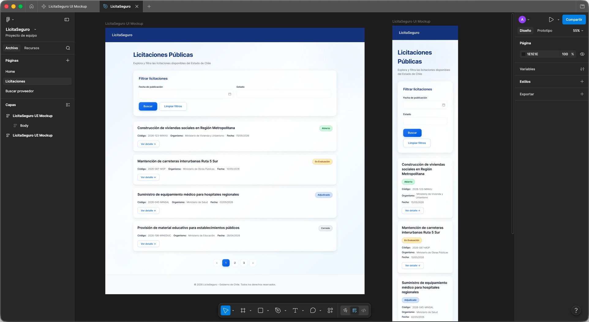
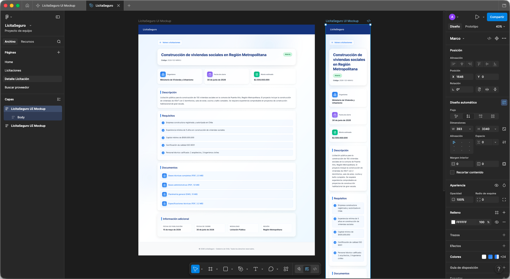
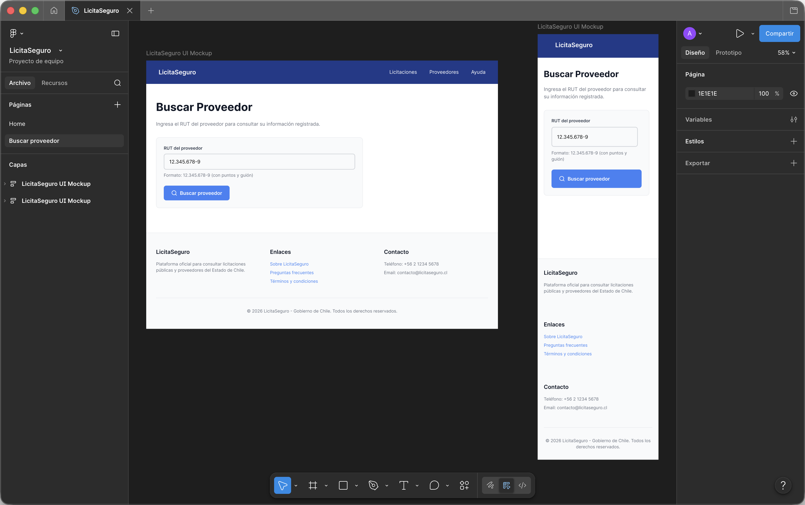
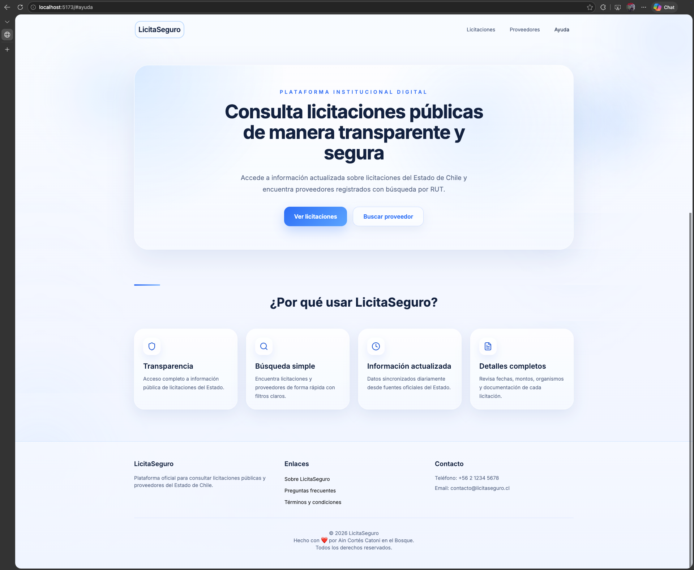

# LicitaSeguro - Plataforma de consulta de licitaciones públicas

LicitaSeguro es una solución web desarrollada para el Examen Final del curso Desarrollo Frontend. El proyecto tiene como objetivo facilitar la consulta de licitaciones públicas y proveedores del Estado de Chile mediante el consumo de servicios de la API de Mercado Público.

## Introducción

La aplicación fue construida con React y Vite, aplicando principios de diseño UI/UX, accesibilidad web y desarrollo responsive. Permite consultar licitaciones, filtrar resultados por fecha y estado, revisar el detalle de cada proceso licitatorio y buscar proveedores mediante RUT.

El desarrollo incorpora componentes reutilizables, validaciones de formularios, paginación, loaders, manejo de errores y consumo de endpoints externos. Además, considera buenas prácticas de accesibilidad.

La solución busca entregar una experiencia clara, estable y adaptable para distintos tamaños de pantalla, manteniendo una estructura preparada para futuras mejoras.

## 🚀 Quick Start

### Instalación

```bash
cd licitaseguro
npm install
```

### Desarrollo

```bash
npm run dev
```

Abre [http://localhost:5173](http://localhost:5173) en tu navegador.

### Build para producción

```bash
npm run build
```

---

## 🔌 Configuración de API

### Con datos mock (por defecto)

El app funciona automáticamente con datos mock si no tienes configurado un token de API. Ideal para desarrollo inicial.

### Con datos reales de Mercado Público

#### 1. Obtén tu token

- Ve a [https://api.mercadopublico.cl/](https://api.mercadopublico.cl/)
- Regístrate o inicia sesión
- Accede a tu panel de control y copia tu **ticket/token**

#### 2. Crea `.env.local`

En la raíz de `licitaseguro/`, copia `.env.local.example` y renómbralo a `.env.local`:

```bash
cp .env.local.example .env.local
```

#### 3. Configura el token

Abre `.env.local` y reemplaza el placeholder:

```env
VITE_MERCADO_PUBLICO_TICKET=tu_token_aqui
```

#### 4. Reinicia el dev server

```bash
npm run dev
```

**Nota:** Vite recarga automáticamente cuando cambias `.env.local`. Si no funciona, detén el servidor y vuelve a iniciar.

### Nota sobre el ticket y el alcance de la evaluación

- Para esta evaluación es válido usar `VITE_MERCADO_PUBLICO_TICKET` desde `.env.local` en desarrollo.
- Si el build se ejecuta en CI, también puede inyectarse desde un `secret` del pipeline.
- Esto cumple con la pauta, porque la rúbrica evalúa consumo real de endpoints, manejo de errores y renderizado robusto.
- En un entorno productivo real, esa credencial no debería quedar en el frontend compilado; en ese caso convendría mover el consumo a backend o serverless.

---

## 🎨 Material de Diseño

Los mockups y el archivo fuente de Figma quedaron copiados dentro del proyecto para que puedan referenciarse directamente desde este `README` y desde la entrega final.

### Home



### Licitaciones



### Detalle de Licitación



### Búsqueda de Proveedor



### Vista adicional



### Archivo fuente

- [Descargar archivo Figma fuente](docs/assets/mockups/LicitaSeguro.fig)

Estos archivos pueden usarse como respaldo para el informe, la justificación UI/UX y la presentación de la evolución del diseño.

---

## 📋 Características

### Licitaciones Públicas
- ✅ Filtrar por fecha de cierre
- ✅ Filtrar por estado (Publicada, Cerrada, Adjudicada, Desierta)
- ✅ Ver listado con paginación (máx 10 por página)
- ✅ Ver detalle completo de cada licitación
- ✅ Información visible: código, nombre, organismo, estado, fechas, monto estimado

### Búsqueda de Proveedor
- ✅ Búsqueda por RUT (con validación de formato y dígito verificador)
- ✅ Información del proveedor encontrado
- ✅ Código de empresa, razón social, estado

### Experiencia de Usuario
- ✅ Loader durante consultas a API
- ✅ Mensajes de error claros y específicos
- ✅ Estados vacíos intuitivos
- ✅ Responsive design (mobile, tablet, desktop)
- ✅ Paginación automática
- ✅ Validaciones de formularios

### Accesibilidad
- ✅ Labels asociados a inputs
- ✅ ARIA labels y roles semánticos
- ✅ Focus visible en navegación por teclado
- ✅ Contraste suficiente (WCAG AA)
- ✅ Orden lógico de tabulación

---

## 🛠️ Estructura del Proyecto

```
src/
├── components/
│   ├── common/           # Componentes reutilizables
│   │   ├── DatePickerField.jsx
│   │   ├── SelectField.jsx
│   │   ├── LoadingState.jsx
│   │   ├── EmptyState.jsx
│   │   ├── NoticeBanner.jsx
│   │   ├── Pagination.jsx
│   │   └── StatusBadge.jsx
│   ├── layout/           # Layout principal
│   │   ├── Header.jsx
│   │   ├── Footer.jsx
│   │   └── PageContainer.jsx
│   ├── licitaciones/     # Módulo de licitaciones
│   │   ├── LicitacionFilters.jsx
│   │   ├── LicitacionList.jsx
│   │   ├── LicitacionCard.jsx
│   │   └── LicitacionDetail.jsx
│   └── proveedores/      # Módulo de proveedores
│       ├── ProveedorSearchForm.jsx
│       └── ProveedorResultCard.jsx
├── services/
│   └── mercadoPublicoApi.js    # Integración con API
├── utils/
│   ├── date.js           # Utilidades de fecha
│   ├── rut.js            # Validación y formato de RUT
│   ├── text.js           # Sanitización de texto
│   └── licitaciones.js   # Mapeo de estados
├── hooks/
│   └── usePagination.js  # Lógica de paginación
├── data/
│   └── mockData.js       # Datos de prueba
├── App.jsx               # Componente principal
├── App.css               # Estilos globales
└── main.jsx              # Punto de entrada
```

---

## 🔑 Variables de Entorno

| Variable | Requerida | Descripción |
|----------|-----------|-------------|
| `VITE_MERCADO_PUBLICO_TICKET` | No | Token de API de Mercado Público. Si está vacío, usa datos mock. |

---

## 📱 Endpoints de API Utilizados

La aplicación consume estos endpoints de [https://api.mercadopublico.cl/servicios/v1](https://api.mercadopublico.cl/servicios/v1):

| Endpoint | Propósito | Filtros |
|----------|-----------|---------|
| `/publico/licitaciones.json` | Listar licitaciones | `fecha`, `estado`, `codigo` |
| `/Publico/Empresas/BuscarProveedor` | Búsqueda de proveedor | `rutempresaproveedor` |

---

## ⚙️ Desarrollo

### Scripts disponibles

```bash
# Inicia servidor de desarrollo con hot reload
npm run dev

# Build para producción
npm run build

# Preview del build (local)
npm run preview

# Linter
npm run lint
```

### Tecnologías

- **React 19** - UI library
- **Vite** - Build tool
- **CSS3** - Estilos (sin frameworks)
- **react-day-picker** - Componente de calendario

---

## 🧪 Pruebas Manuales Recomendadas

### Con Mock Data (sin token)

1. Abre [http://localhost:5173](http://localhost:5173)
2. Ve a "Licitaciones"
3. Filtra por fecha o estado (usa datos ficticios)
4. Verás resultados mock
5. Haz clic en "Ver detalle"
6. Regresa y prueba "Buscar proveedor"
7. Busca un RUT válido (ej: `76.345.619-k`)

### Con API Real (con token válido)

1. Configura `.env.local` con un token válido
2. Reinicia `npm run dev`
3. Repite pasos anteriores
4. Los datos ahora vienen de Mercado Público

### Validaciones de Formulario

- Intenta buscar sin seleccionar nada → ver error
- Intenta un RUT inválido → ver error específico
- Intenta una fecha fuera de rango → ver error

---

## 🐛 Troubleshooting

### "Error de configuración: VITE_MERCADO_PUBLICO_TICKET no está definido"

**Solución:** Crea `.env.local` en la raíz de `licitaseguro/` (ver sección de configuración arriba).

### Los cambios en `.env.local` no se reflejan

**Solución:** Detén el servidor (`Ctrl+C`) y reinicia con `npm run dev`.

### La API devuelve 401 o 403

**Solución:** Tu token es inválido o expiró. Obtén uno nuevo en [https://api.mercadopublico.cl/](https://api.mercadopublico.cl/).

### Veo datos mock pero quiero datos reales

**Solución:** Verifica que `.env.local` esté correctamente nombrado (sin `.example`) y tenga un token válido.

---

## 📝 Notas de Desarrollo

- La app usa `isMercadoPublicoConfigured()` para decidir si usa API real o mock
- Si hay `ticket`, la primera entrada a `Licitaciones` intenta cargar desde API real en vez de dejar el listado inicial en `mock`
- Los errores de API se capturan y muestran como banners informativos
- Las respuestas vacías se diferencian de los errores de red
- Si el detalle real falla pero el ítem ya existe en el listado, la vista conserva esos datos como respaldo
- Todos los datos se normalizan antes de usarse en componentes
- El RUT se valida con el algoritmo oficial chileno (dígito verificador)

---

## 📚 Referencias

- [API de Mercado Público](https://api.mercadopublico.cl/)
- [Documentación Vite](https://vitejs.dev/)
- [Documentación React](https://react.dev/)

---

## ✅ Checklist de Setup

- [ ] Clonar o descargar el proyecto
- [ ] `cd licitaseguro && npm install`
- [ ] Copiar `.env.local.example` a `.env.local` (opcional, usa mock por defecto)
- [ ] Actualizar token en `.env.local` si tienes uno (opcional)
- [ ] `npm run dev`
- [ ] Abre [http://localhost:5173](http://localhost:5173)
- [ ] Prueba ambos módulos (Licitaciones y Proveedores)
- [ ] Verifica que los filtros funcionen
- [ ] Para producción: `npm run build`

---

**Última actualización:** Junio 2026
